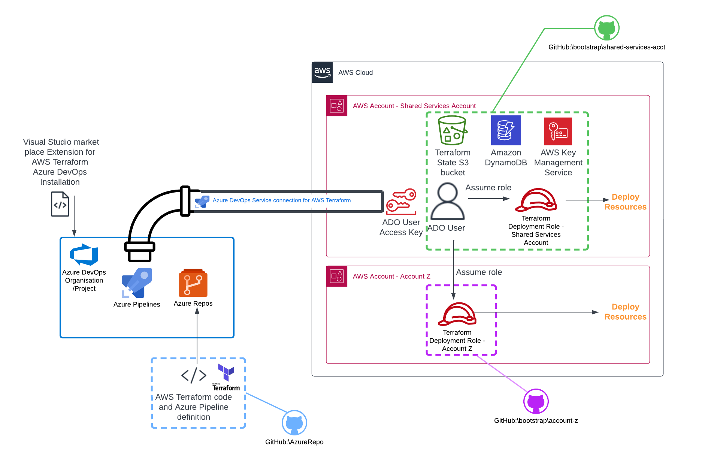

# Overview

Please see blog site hhttps://devbuildit.com/2023/10/02/aws-orchestration-via-azuredevops-terraform-the-ugly-way/ for detailed explaination of this repo contents.

This repo (and associated blog) will help you to setup a test environment on AWS so you can following the blog tutorial above.  AWS Infrastructure deployment:
 

## Requirements:
- AWS Account x 2
- Terraform CLI installed with access to your target AWS account

## key
Repo uses the following keys
XXXX-ss-XXXX  = AWS AccountID for the shared services account
XXXX-az-XXXX  = AWS AccountID for Account Z

## Deployment
- Clone repo into location device

### Acount Z infrastructure
- cd into folder bootstrap/account-z
- Update variables as listed in folder README.md file 
- Run command 'Terraform init'
- Run command 'Terraform plan' 
- Run command 'Terraform apply' and type 'yes' to confirm deployment

### Shared servers  infrastructure
- cd in folder bootstrap/shared-services-acct
- Update variables as listed in folder README.md file 
- Run command 'Terraform init'
- Run command 'Terraform plan' 
- Run command 'Terraform apply' and type 'yes' to confirm deployment

### Azure Repo files
- clone Azure Devops Repo
- cd into folder assoicated with Azure Repo and copy files from github repo folder AzureRepo
- Update variables as listed in folder README.md file
- Upload the updated files to your Azure Repo

## Tidy up (AWS resources)
- remove access key for ADO user in AWS Shared Services Account
- Empty and Delete Azure Dev deployed S3 test buckets
- Run command 'Terraform destroy' from each directory (account-z & shared-services-acct)